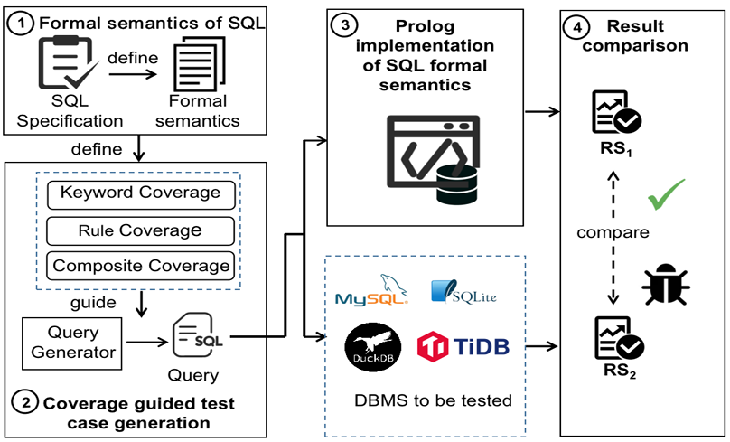

近日，DBSys实验室的刘爽老师关于数据库标准符合性测试的论文被数据库顶会VLDB 2025接收。该论文首次定义关系数据库标准符合性问题，并创新性地提出基于SQL标准语义的自动化测试方法。在6个广泛应用的关系数据库系统上发现了32个缺陷或不一致问题。该工作从SQL标准出发发现数据库中的实现缺陷，为不同数据库实现与SQL标准的一致性检测提供自动化方案。中国人民大学DBSys实验室以实际应用需求为牵引，聚焦数据库系统（包括云原生数据库、分布式数据库、智能数据库、图数据库等）关键技术研究与学术前沿技术创新，近年来在数据库系统研发、数据库测试、智能数据库等方向发表CCF A类论文30余篇。与数据库头部企业开展产学研用多方合作，将创新技术集成到企业的真实系统中进行成果验证，取得了一系列重要研究成果。

<!--more-->

**题目：Semantic Conformance Testing of Relational DBMS**

作者：刘爽，田承霖，孙军，王瑞丰，卢卫，赵涌鑫，薛吟兴，王俊杰，杜小勇

**图 1：SemConT整体结构**

摘要：
关系型数据库管理系统（RDBMS）的实现需要遵循SQL标准。然而，目前没有工具可以自动测试这种标准符合性。其主要原因有两个。首先，SQL标准规范是用自然语言描述的，易产生歧义且无法直接执行。其次，难以自动生成能够全面覆盖SQL标准中定义内容（如关键字和参数）的测试查询。针对上述难点，本工作提出了首个基于语义的RDBMS标准符合性测试方法。本文有以下三个贡献。首先，形式化定义了SQL语言的指称语义，并使用Prolog实现该语义，作为一个可执行的RDBMS标准，用于与现有RDBMS进行差异测试。其次，基于定义的形式化语义提出了三种覆盖度指标，并设计了一种覆盖指导的查询生成算法，有效地生成能够达到高语义覆盖的查询语句。最后，将该方法实现为一个测试工具SemConT，并应用于六个广泛使用且经过充分测试的RDBMS（如MySQL、PostgreSQL和OceanBase），发现了得到开发者确认的19个BUG和13个不一致性问题。

