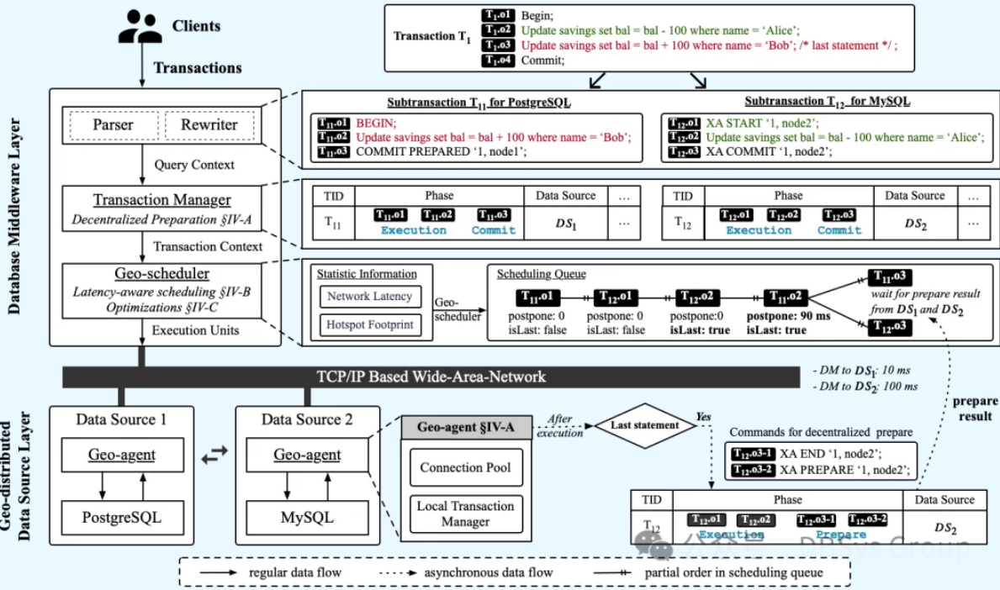
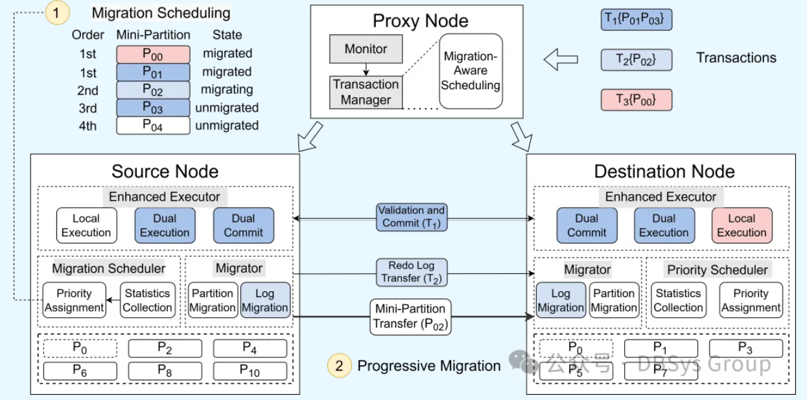

数据库系统实验室的博士生庄琪钰关于网络时延感知的分布式事务处理的论文以及博士生丁正浩关于实时数据迁移在分布式数据库中的应用的论文被数据库顶会ICDE 2025接收！

<!--more-->

近日，数据库系统实验室的博士生庄琪钰关于网络时延感知的分布式事务处理的论文被数据库顶会ICDE 2025接收。该论文首次提出了一种名为GeoTP的跨空间域分布式事务处理方法，旨在解决由于网络延迟和锁争用导致的事务处理性能问题。论文通过融合三项创新技术，显著提升了分布式事务处理的效率。实验结果表明，GeoTP在中间件Apache Shardingsphere上的实现，性能最高提升至ShardingSphere的17.7倍，充分展示了其在大规模分布式事务处理中的应用潜力。这一研究为跨空间域的分布式事务处理提供了高效的解决方案，具有重要的实际意义，尤其是在处理全球范围内异构数据源和高延迟网络环境下的事务时。

博士生丁正浩关于实时数据迁移在分布式数据库中的应用的论文被数据库顶会ICDE 2025接收。该论文提出了Promi，一种针对分布式数据库系统的实时数据迁移方法，旨在解决由于倾斜和动态工作负载引起的负载不均问题。现有的迁移方法通常面临在过载节点上继续处理事务或在迁移过程中中断实时事务的难题，而Promi通过创新性地采用迷你分区迁移和图调度技术，有效克服了这些局限。实验结果表明，与现有的最先进方法相比，Promi的吞吐量提高了1.5倍，负载平衡时间缩短了60%。这一研究为分布式数据库中的实时数据迁移提供了高效的解决方案，具有重要的应用价值，特别是在处理动态工作负载和要求零停机时间的环境下。

中国人民大学数据库系统实验室以实际应用需求为牵引，聚焦数据库系统（包括云原生数据库、分布式数据库、智能数据库、图数据库等）关键技术研究与学术前沿技术创新，近年来在数据库系统研发、数据库测试、智能数据库等方向发表CCF A类论文30余篇。与数据库头部企业开展产学研用多方合作，将创新技术集成到企业的真实系统中进行成果验证，取得了一系列重要研究成果。

**题目：GeoTP: Latency-aware Geo-Distributed Transaction Processing in Database Middlewares**

作者：庄琪钰、史心悦、刘爽、卢卫、赵展浩、陈育兴、李彤、潘安群、杜小勇

**摘要**：

支持分布式事务处理的数据库中间件在众多应用中得到了广泛采用，在全球业务中，应用需要处理跨空间域部署的异构数据源。然而，由于中间件和数据源之间的网络延迟较高，以及锁争用时间较长，事务在等待并发事务的锁时可能会受阻，从而显著降低了事务处理性能。为了解决这一问题，本文提出了一种名为 GeoTP 的网络时延可感知的跨空间域分布式事务处理方法。GeoTP 融合了三项关键技术来提升跨空间域分布式事务处理的性能。

首先，我们提出了一种去中心化的准备机制，减少了分布式事务对网络往返的需求。其次，我们设计了一种网络时延可感知调度器，通过策略性地推迟锁获取时间点，最大限度地减少锁争用时间。第三，我们为调度器提出了启发式优化方案，以进一步减少锁争用时间。我们在中间件 Apache Shardingsphere 上实现了 GeoTP，并将其扩展到 Apache ScalarDB 中。YCSB 和 TPC-C 的实验结果表明，GeoTP 的性能最多可以比 Shardingsphere 高 17.7 倍。

**题目：Promi: Progressive Live Migration in Distributed Database Systems**

作者：丁正浩，张心怡，卢卫，马文龙，张文亮，杜小勇

**摘要**：

数据分区是分布式数据库系统中的一项基本技术，但倾斜和动态的工作负载往往会导致节点间负载分布不均。实时迁移通过在节点间重新分配数据分区来解决负载不均衡。然而，现有的迁移方法要么继续在过载的节点上处理繁重的事务负载，要么在迁移过程中阻塞并中止实时事务，无法同时实现快速负载平衡和事务零停机。本文提出了Promi，一种实时数据迁移方法，它以迷你分区而不是整个分区的粒度逐步地迁移数据。为了确保快速的负载平衡，我们提出了一种基于图的迁移调度器，该调度器优先考虑热的迷你分区的迁移，并在迁移过程中最大限度地减少潜在的分布式事务。为了实现零停机时间并提高系统性能，我们提出了一种事务管理器，该管理器根据当前迁移状态路由和调度所涉及的事务。实验表明，与最先进的方法相比，Promi的吞吐量提高了1.5倍，负载平衡时间缩短了60%。