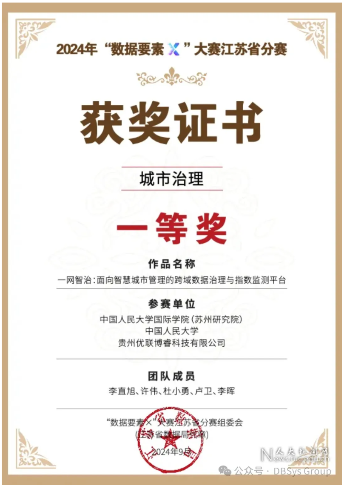
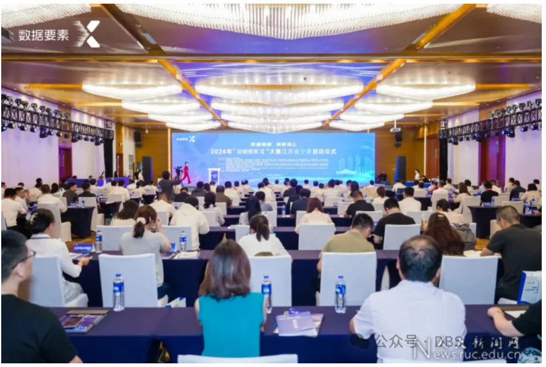

近日，中国人民大学信息学院数据库系统实验室杜小勇教授、卢卫教授与智慧治理学院李直旭、许伟教授、贵州大学教授李晖组成的“一网智治”团队，在2024年“数据要素×”大赛江苏省分赛中荣获城市治理赛道一等奖！本次获奖的“一网智治”参赛作品，立足于数据库系统实验室承担的国家重点研发计划《面向城市智能服务的数据治理体系与共享平台》的研究成果，聚焦解决智慧城市管理中的关键技术难题，开发了一套跨域数据治理与指数监测平台。

<!--more-->

**大赛介绍**

“数据要素×”大赛是全国首个专注于数据要素开发与应用的大型赛事，致力于推动数据要素的高效利用和技术创新，为探索数据驱动的经济与社会发展新模式提供平台。大赛覆盖多个赛道，内容涵盖从地方分赛到全国总决赛的完整赛程，吸引了全国范围内的高校、科研机构和企业广泛参与。

在江苏省分赛中，大赛设置了十二个主题赛道，每个赛道仅评选出两个一等奖，竞争异常激烈。本次获奖项目属于江苏省“数据要素×”城市治理赛道，从同赛道的一百多支队伍中成功突围。

**参赛项目作品介绍**

本次参赛的“一网智治：面向智慧城市管理的跨域数据治理与指数监测平台”项目，聚焦于智慧城市管理中的三大核心挑战——“社会系统难观测”“跨域数据难治理”和“突发事件难预测”。项目团队通过技术创新和深度实践，提出了一套全新的解决方案，依托跨域数据治理、智能指数监测以及智能风险预警等核心技术手段，打造了一个面向未来城市管理的数字化平台。平台的设计理念注重解决城市管理中的复杂问题，为智慧城市治理提供了创新性思路。

该成果目前已经在苏州工业园区、南京、贵州等地进行了示范应用，并取得了显著成效。例如，苏州工业园区社会治理圆融指数展示系统通过多源数据汇聚和治理，实现了全面监测和评估；贵州省财政监管局财政指标监管服务通过构建评价监测指标体系，强化了风险监控和数据分析能力。不仅为政府部门和公共服务机构提供了精细化、智能化的管理工具，还为城市的可持续发展和居民生活质量的提升提供了有力支持。 

项目团队表示将继续深入探索数据要素在城市治理中的应用潜力，推动智慧城市建设向更高层次发展。“一网智治”项目的获奖，不仅是对团队成员专业能力的肯定，也是对项目在智慧城市管理领域创新实践的认可。随着项目的不断深入和完善，该项目将为城市管理现代化和提升治理能力发挥更大的作用。
