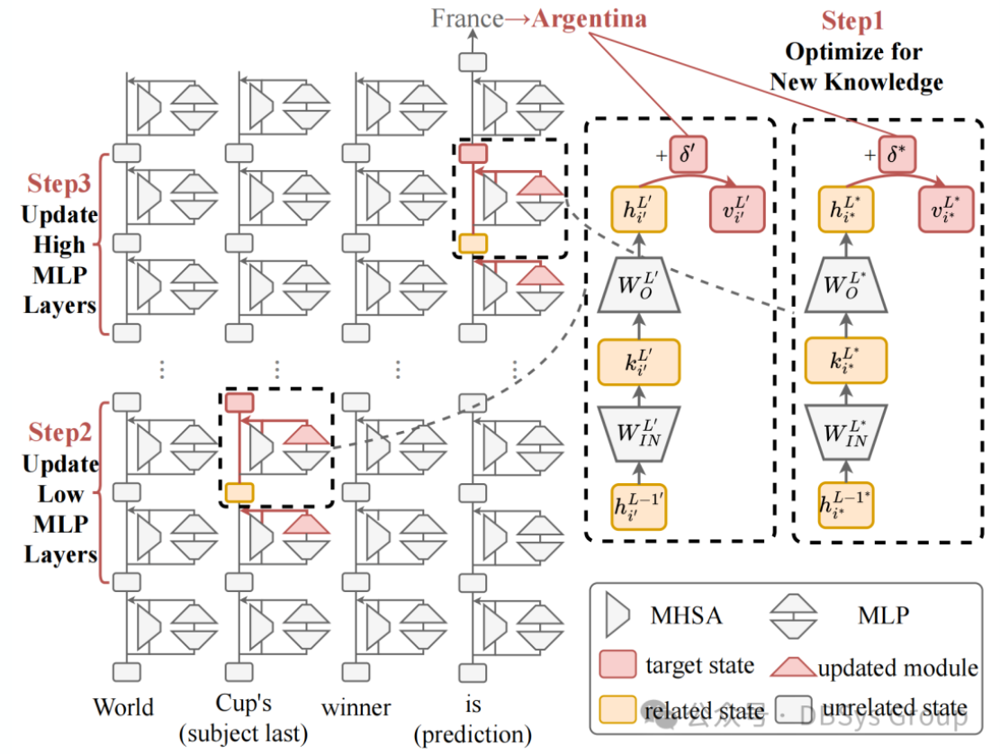

数据库系统实验室的博士研究生施文航同学关于大规模语言模型的知识编辑方法的论文被国际顶级人工智能学术会议 AAAI 2025 接收！

<!--more-->

近日，数据库系统实验室的博士研究生施文航同学关于大规模语言模型的知识编辑方法的论文被国际顶级人工智能学术会议 AAAI 2025 接收。该论文提出了JEEP方法（联合知识编辑——信息丰富与概率提升），旨在优化大规模语言模型的知识更新。现有编辑方法主要聚焦低层信息，但未能有效处理原始和目标答案之间的分歧。JEEP 通过对比探测定位低层的信息丰富和高层的概率提升，进行双层编辑，确保更新互补且减少干扰。实验表明，JEEP 在多个模型上表现最佳，验证了其有效性。中国人民大学 DBSys 实验室以实际应用需求为牵引，聚焦数据库系统（包括云原生数据库、分布式数据库、智能数据库、图数据库等）关键技术研究与学术前沿技术创新，近年来在数据库系统研发、数据库测试、智能数据库等方向发表 CCF A 类论文 30 余篇。与数据库头部企业开展产学研用多方合作，将创新技术集成到企业的真实系统中进行成果验证，取得了一系列重要研究成果。

**题目：Joint Knowledge Editing for Information Enrichment and Probability Promotion**

作者：施文航，陈逸人，卞书青，赵哲，张心怡，胡鹏飞，卢卫，杜小勇

**图1 Procedure of JEEP**

**摘要**：

大规模语言模型中的知识需要及时更新，以反映现实世界信息的动态变化。为了更新这些知识，大多数知识编辑方法侧重于低层次，因为最近对知识召回过程的探讨揭示了答案信息主要集中在低层。然而，这些探讨只能揭示原始答案的关键召回阶段，而编辑的目标是纠正模型对目标答案的预测。这种不一致表明，现有的探测方法和相关的编辑方法是存在不足的。为了缓解这种不一致并识别关键的编辑区域，我们提出了一种基于对比的探测方法，并定位了模型在原始答案和目标答案之间行为分歧的两个关键阶段：低层的信息丰富与高层的概率提升。基于这些洞察，我们开发了联合知识编辑方法——信息丰富与概率提升（JEEP），该方法同时编辑低层和高层，以修改这两个关键的召回阶段。考虑到由于双重修改导致的相互干扰和遗忘增加，JEEP被设计为确保对不同区域的更新具有相同的目标并且是互补的。我们通过编辑成千上万的事实，针对不同的模型（如 GPT-J（6B）和 LLaMA（7B））进行严格评估，并解决多种编辑目标，如增加事实性和反事实知识。在所有测试场景中，JEEP 都取得了最佳的表现，验证了我们探测方法揭示的有效性以及编辑方法设计的合理性。

**JEEP 在数据库领域的应用**：

随着模型规模的不断增大，如何高效低成本的更新模型知识同时避免灾难性遗忘，正受到快速的受到越来越多的关注。比如在数据库领域，数据或者负载驱动的模型经常遇到在动态环境下快速更新的需求。此时，JEEP 提供了一种灵活高效的模型更新方式，不仅能让模型快速学习新知识、适应新环境，还能让模型不遗忘旧知识，保持在旧任务上的推理能力。

