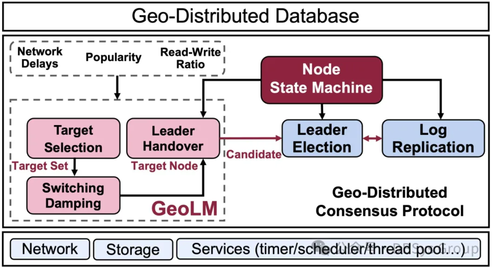

数据库系统实验室的博士生徐都玲等同学的论文被网络顶会 INFOCOM 2025 接收！

<!--more-->

近日，数据库系统实验室的博士生徐都玲等同学的论文被网络顶会 INFOCOM 2025 接收！这项研究是在CCF-华为胡杨林基金支持下，数据库系统实验室李彤课题小组与华为数据库GaussDB团队的最新合作成果，该成果将于2025年5月19日至22日在英国伦敦举办的会议上进行报告展示。

该论文提出的GeoLM是一种性能导向的一致性协议领导者管理机制，专为跨广域网分布式共识协议设计，首次结合了跨域数据库系统的网络动态和应用动态，主动优化领导者选择与切换，从而提升数据库的事务处理性能GeoLM 跨越了网络与数据库领域的界限，为跨域分布式系统的共识协议领导者管理提供了创新方案，不仅提升了系统性能，还显著降低了跨广域网的网络动态和数据库应用动态对系统稳定性的影响。

中国人民大学数据库系统实验室以实际应用需求为牵引，聚焦数据库系统（包括云原生数据库、分布式数据库、智能数据库、图数据库等）关键技术研究与学术前沿技术创新，近年来在数据库系统研发、数据库测试、智能数据库等方向发表 CCF A 类论文30余篇。与数据库头部企业开展产学研用多方合作，将创新技术集成到企业的真实系统中进行成果验证，取得了一系列重要研究成果。

**题目：GeoLM: Performance-oriented Leader Management for Geo-Distributed Consensus Protocol**

作者：徐都玲，张大方，李彤，柴云鹏，孙泽港，李伟明，刘洋凡，王启鹏，梁家琦（华为），任阳（华为），卢卫，杜小勇

**图1 : GeoLM 整体框架**

**摘要**：

跨国企业的全球化业务需求催生了跨域分布式数据库，其中基于领导者-跟随者的共识协议是保证分布于不同区域的副本一致性的关键。相比运行在单一数据中心的传统数据库，在跨多个数据中心的跨域分布式数据库中确定共识协议中的领导者节点对性能的影响更为显著。然而，由于网络和应用动态性（例如网络延迟、节点受欢迎程度、操作读写比）的影响，传统的领导者管理方式的性能远未达到理想水平。

本文提出了GeoLM，这是一种面向性能的地理分布式共识协议领导者管理方法。GeoLM能够捕捉网络和应用动态性，并以有限的切换成本主动进行无缝的领导者交接。我们的跨域分布式实验结果表明，GeoLM在性能上较基线方法（如Raft和Geo-Raft）提高了最多49.75%，并且与最新的共识协议（如SwiftPaxos、CURP和EPaxos）相比表现出较好的性能。

